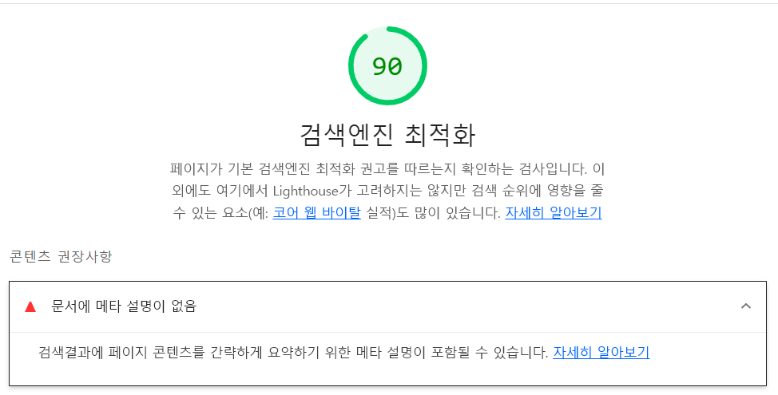

# 🕶 성능 개선

모으잡 프로젝트 기획과 디자인을 수정하고 나서 그다음 작업으로 성능 개선을 목표로 잡았다. 성능 개선의 주요한 요소들, SEO, Web Vital들에 대해 정리하고 적용해보려 한다.

## ⛳ 모으잡 구글 검색 사이트에 띄우기

가장 간단하게 할 수 있는 성능 개선은 **SEO**라고 생각되었다. 서버 사이드 렌더링의 장점이지만 적절한 meta정보와 title을 입력하지 않아 lighthouse 검사에서 부족한 모습이 있었다.

 

개선하기 위해서 먼저 기존 `SEO` 컴포넌트를 사용하려 했지만, 조금 더 편리하게 사용할 수 있는 `Next-SEO`라이브러리를 이용해서 간단하게

sitemap
